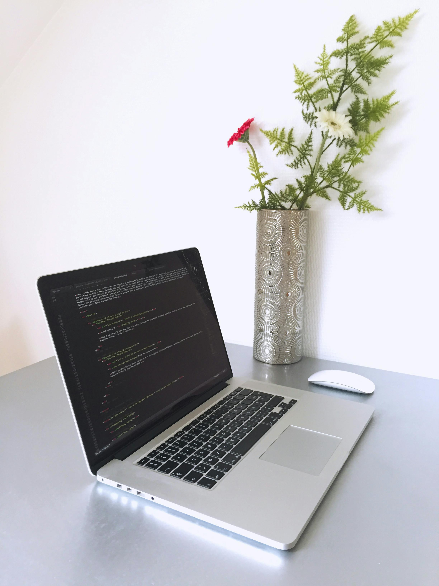

@import url('https://fonts.googleapis.com/css2?family=Playfair+Display:ital,wght@0,400..900;1,400..900&display=swap');
*{
    margin: 0;
    padding: 0;
    box-sizing: border-box;
    text-decoration: none;
    border: none;
    outline: none;
    font-family: DM Serif Text;
}
body{
    display: flex;
    justify-content: center;
    align-items: center;
    min-height: 100vh;
    background: url(pic.jpg);
    background-attachment: fixed;
    background-size: cover;
}
.wrapper {
    position:relative;
    width: 66rem;
    height: 45rem;
    padding: 2rem;
    perspective: 250rem;
    animation: show-animate 2s forwards;
    box-shadow: 5px 5px 55px hsl(0, 0%, 0.3%);
   }
   @keyframes show-animate {
    0%, 30% {
        opacity: 0;
        transform: rotate(-30deg);
    }
    100% {
        opacity: 1;
        transform: rotate(0deg);
    }
   }
.cover {
    position: absolute;
    top: 0;
    left: 0;
    width: 50%;
    height: 100%;
    background: rgb(6, 226, 241);
    box-shadow: rgb(234, 3, 34);
    border-top-left-radius:  .6rem;
    border-bottom-left-radius:  .6rem;
    transform-origin: right;
}
.cover.cover-left {
   z-index: -1;
}
.cover.cover-right{
    z-index: 100;
    transition: transform 1s cubic-bezier(.645, .045, .355, 1);
}

.cover.cover-right.turn {
    transform: rotateY(180deg);
}
.book{
    position: relative;
    width: 100%;
    height: 100%;
    display: flex;
    perspective: 250rem;
}
.book .book-page {
   position: absolute;
   width: 50%;
   height: 100%;
   background: rgb(246, 235, 235);
   box-shadow: 0 0.2rem rgb(182, 9, 188);
   display: flex;
   padding: 2rem;
   border: solid rgba(241, 8, 233, 0.062);
}
.book-page.page-left{
  box-shadow: -.6rem .6rem .6rem rgba(0, 0, 0, 0.5);
}
.profile-page img{
    width: 180px;
    border-radius: 50%;
    border: .1rem solid rgb(243, 6, 219);
    margin-bottom: .8rem;
}
.profile-page{
    display: flex;
    flex-direction: column;
    justify-content: center;
    align-items: center;
}
.profile-page h1{
    font-size: 2.7rem;
    line-height: 1;
}
.profile-page h3{
    font-size: 1.5rem;
    color: rgb(119, 9, 222);
}
.profile-page p {
    text-align: justify;
}
.profile-page .social-media{
    margin: .6rem 0 .8rem;
}
.profile-page .social-media a {
    display: inline-flex;
    justify-content: center;
    align-items: center;
    width: 2.0rem;
    height: 2.0rem;
    background: transparent;
    border: .1rem solid rgb(243, 6, 219);
    border-radius: 50%;
    font-size: 1.3rem;
    color: rgb(220, 8, 223);
    margin: 0 .2rem;
}
.profile-page .social-media a:hover{
    background: rgb(141, 91, 242);
    color: rgb(240, 8, 8);
}
.profile-page .social-media a:active{
    background: green;
}
.btn-box{
    margin: 2.0rem;
}
.btn {
    display: inline-flex;
    align-items: center;
    justify-content: center;
    width: 9.5rem;
    height: 3rem;
    background: green;
    border: .1rem solid rgb(243, 6, 219);
    border-radius: .3rem;
    font-size: 1rem;
    color: white;
    font-weight: 500;
    margin: 0.1rem;
}
.btn:hover{
    background: rgb(210, 83, 233);
    color: black;
}
.btn:active{
    background: darkgreen;
}

.page-right {
    position:absolute;
    right: 0;
    transform-style: preserve-3d;
    transform-origin: left;
    transition: transform 1s cubic-bezier(.645, .045, .355, 1);
}

.book-page .page-front{
    position: absolute;
    top: 0;
    left: 0;
    width: 100%;
    height: 100%;
    background: rgb(246, 235, 235);
    padding: 1.5rem 2rem;

}
.book-page .page-back{
    position: absolute;
    top: 0;
    left: 0;
    width: 100%;
    height: 100%;
    background: rgb(246, 235, 235);
    padding: 1.5rem 2rem;

}
.book-page .page-front{
    transform: rotateY(0deg) translateZ(1px);
}
.book-page .page-back{
    transform: rotateY(180deg) translateZ(1px); 
}
.title{
    text-align: center;
    margin-bottom: 1rem;
}
.workeduc-box {
    border-left: solid rgb(248, 7, 208);
}
.workeduc-box .workeduc-content{
    position: relative;
    padding-left: 1.6rem;
    margin-bottom: 1.2rem;
}
.workeduc-box .workeduc-content::before{
    content: '';
    position: absolute;
    top: 0;
    left: -0.65rem;
    width: 1.2rem;
    height: 1.2rem;
    background: rgb(255, 0, 183);
    border-radius: 50%;

}
.workeduc-content .year{
    color: rgb(243, 5, 191);
}
.workeduc-content .year i{
    margin-right: .4rem;
}
.number-page{
    position: absolute;
    bottom: 1.2rem;
    left: 50%;
    transform: rotateX(-50%);
}
.next-page{
    position: absolute;
    align-items: center;
    justify-content: absolute;
    bottom: .9rem;
    right: 1.5rem;
    width: 2rem;
    height: 2rem;
    cursor: pointer;
    font-size: 2rem;
    color: rgb(122, 8, 230);
    display: inline-flex;
}
.next-page:hover{
    background: rgb(0, 234, 255);
}
.next-page:active{
     background: green;
     color: black;
}
.book-page.page-right.turn{
    transform: rotateY(-180deg);

}
.next-page.back{
    left: 1.5rem;
}
.services-box{
    display: flex;
    flex-wrap: wrap;
    gap:1.5rem;
}
.services-box .services-content{
    flex: 1 1 10rem;
    border: solid rgb(241, 8, 210);
    border-radius: .5rem;
    padding: .8rem .5rem 1.1rem;
    text-align: center;
}
.services-content i {
    font-size: 2.5rem;
    color: rgb(161, 10, 236);
}
.services-content h3{
    font-size: 1.1rem;
}
.services-content p{
    margin: .2.5rem 0.8rem;
}
.services-content .btn{
    width: 8rem;
    height: 2.5rem;
}
.skill-box{
    display: flex;
    flex-wrap: wrap;
    gap:1.5rem;
}
.skill-box .skills-content {
    flex: 1 1 20rem;
}
.skills-content{
    font-size: 1.3rem;
    line-height: 1;
    margin-bottom: .6rem;
}
.skills-content.content{
    display: flex;
    flex-wrap: wrap;
    gap: .8rem;
}
.skills-content .content span{
    display: inline-flex;
    flex-direction: column;
    justify-content: center;
    align-items: center;
    width: 6rem;
    height: 5rem;
    border: solid rgb(234, 0, 255);
    border-radius: .3rem;
    font-weight: 600;
    margin-bottom: 10px;
    cursor: pointer;
}
.skills-content .content span i{
    font-size: 3rem;
    color: rgb(28, 252, 8);
}
.skills-content .content span{
    box-shadow: rgb(182, 9, 188);
}
.portfolio-box .img-box{
    display: flex;
    width: 100%;
    height: 15rem;
    border: solid rgb(191, 0, 255);
    border-radius: .5rem;
    overflow: hidden;
}
.portfolio-box .img-box img{
    width: 100%;
    object-fit: cover;
    transition: .5s ease;
}
.portfolio-box .img-box:hover img {
    transform: scale(1.1);
}
.portfolio-box .info-box{
    margin: 1rem 0 1.5rem;
}
.portfolio-box .info-box .info-title {
   display: flex;
   justify-content: space-between;
   align-items: center;
   margin-bottom: 1rem;
}
.portfolio-box .info-box .info-title h3 {
    font-size: 1.3rem;
}
.portfolio-box .info-box .info-title a {
    display: flex;
    align-items: center;
    color: rgb(238, 8, 241);
}
.portfolio-box .info-box .info-title a i {
    margin-left: .3rem;
}
.portfolio-box .info-box p:nth-of-type(1) {
    font-weight: 600;
}
.portfolio-box .bnt-box {
    display: flex;
    justify-content: center;
}
.portfolio-box .bnt-box .btn{
    margin: 0 1.15rem;
}
.contact-box{
    text-align: center;
}
.contact-box .field{
    width: 100%;
    background: rgb(252, 251, 249);
    border: solid rgb(234, 0, 255);
    border-radius: .3rem;
    padding: .8rem;
    font-size: 1rem;
    color: black;
    margin-bottom: 1.5rem;
}
.contact-box .field::placeholder{
    color: blueviolet;
}
.contact-box textarea{
    resize: none;
    height: 15rem;
}
.contact-box .btn {
    cursor: pointer;
}
.back-profile {
    position: absolute;
    bottom: 1.2rem;
    right: 2rem;
    width: 2rem;
    height: 2rem;
    background: transparent;
    border: solid rgb(234, 0, 255);
    border-radius: .3rem;
    font-size: 1.1rem;
    color: rgb(124, 3, 230);
    display: inline-flex;
    align-items: center;
    justify-content: center;
}
.back-profile p{
    position: absolute;
    top: 0;
    left: 50%;
    transform: translateX(-50%) scale(.5);
    font-size: 1rem;
    opacity: 0;
    color: rgb(3, 3, 3);
}
.back-profile:hover{
    background: rgb(3, 239, 168);
    color: rgb(255, 255, 255);
}
.back-profile:hover p{
    opacity: 1;
    transform: translateX(-50%) scale(1);
    top: -1.8rem;
}
<!DOCTYPE html>
<html lang="en">
<head>
    <meta charset="UTF-8">
    <meta name="viewport" content="width=device-width, initial-scale=1.0">
    <title>MY PERSONAL PORTFOLIO</title>
    <link rel="stylesheet" href="home.css">
    <link href='https://unpkg.com/boxicons@2.1.4/css/boxicons.min.css' rel='stylesheet'>
    
</head>
<body>
    

        

        

        

            <!--profile page-->
            

                

                    
                    <h1>Evans Rono</h1>
                    <h3>Web Developer</h3>
                    

                        <a href="https://www.fb.com/l/6lp1kJRRR"><i class='bx bxl-facebook-circle'></i></a>
                        <a href="https://wa.me/message/2ABQYDR6P7MBK1  "><i class='bx bxl-whatsapp'></i></a>
                        <a href="#"><i class='bx bxl-linkedin'></i></a>
                        <a href="#"><i class='bx bxl-twitter'></i></a>
                    

                    
Hi I'm Evans Rono I'm a dedicated computer science student with a strong foundation in programming, data structures, and algorithms. My passion lies in developing innovative solutions to real-world problems, and I'm driven by the potential of technology to make a positive impact.

                    
<h3>Conclusion</h3>

                        I am eager to apply my technical skills and problem-solving abilities to contribute to a dynamic and innovative team. My passion for technology and commitment to excellence drive me to create impactful solutions that make a difference.

                    

                        <a href="#" class="btn">Download Cv</a>
                        <a href="#" class="btn Contact-Me">Contact Me</a>

                    

                

            

            <!--page 1 & 2-->
            

                <!--page 1 (work Experience)-->
                

                <h1 class="title">Work Experience</h1>
                

                    

                        <i class='bx bx-calendar'></i>2023-2024
                        <h3>Web Developer-Company</h3> 
                        
<h4>Software Engineering Intern.</h4> 
                            <h4>Alfa-tex KenGen</h4>
                            Dates: June 2023 - August 2023
                            Contributed to a team developing a new feature for the company's flagship product.
                            Utilized Python and Django to build RESTful APIs.  
                           <h4> Certifications</h4>
                            <h4>Comp TIA A</h4>
                            AWS Certified Solutions Architect - Associate  
                            <h4>Awards and Honors</h4>
                            Dean's List (Fall 2022, Spring 2023)
                            Best Project Award at [JKUAT Hackathon]  
                           <h4> Publications</h4>
                            Paper Title
                            Journal Name
                            Co-authors: [Evans Rono]

                    

                    

                        <i class='bx bx-calendar'></i>2022-2023
                        <h3>Web Developer-Company</h3>
                        
Lorem ipsum dolor sit, amet consectetur adipisicing elit. Iusto debitis commodi quaerat consequuntur unde provident amet eum placeat quo. Sequi laboriosam expedita neque similique assumenda.

                    

                

                1
                 <!--next button-->
                
                    <i class='bx bx-chevron-right'></i>
                
                

                <!--page 2 (Education)-->
                

                <h1 class="title">Education</h1>
                

                

                    <i class='bx bx-calendar'></i>2017-2018
                    <h3>Kisii University</h3>
                    
Lorem ipsum dolor sit, amet consectetur adipisicing elit. Iusto debitis commodi quaerat consequuntur unde provident amet eum placeat quo. Sequi laboriosam expedita neque similique assumenda.

                

                

                    <i class='bx bx-calendar'></i>2018-2019
                    <h3>Kisii University</h3>
                    
Lorem ipsum dolor sit, amet consectetur adipisicing elit. Iusto debitis commodi quaerat consequuntur unde provident amet eum placeat quo. Sequi laboriosam expedita neque similique assumenda.

                

                

                    <i class='bx bx-calendar'></i>2019-2020
                    <h3>Kisii University</h3>
                    
Lorem ipsum dolor sit, amet consectetur adipisicing elit. Iusto debitis commodi quaerat consequuntur unde provident amet eum placeat quo. Sequi laboriosam expedita neque similique assumenda.

                

                

                    <i class='bx bx-calendar'></i>2020-2021
                    <h3>Kisii University</h3>
                    
Lorem ipsum dolor sit, amet consectetur adipisicing elit. Iusto debitis commodi quaerat consequuntur unde provident amet eum placeat quo. Sequi laboriosam expedita neque similique assumenda.

                

            

            2
                <!--prev button-->
               
                   <i class='bx bx-chevron-left'></i>
            
                

            

            <!--page 3 & 4-->
            

                <!--page 3 (My Services)-->
                

                    <h1 class="title">My Services</h1>
                    

                    

                        <i class='bx bx-code-alt'></i>
                        <h3>Web Development</h3>
                        
Lorem, ipsum dolor sit amet consectetur adipisicing elit.

                        <a href="#" class="btn">Read More</a>
                    

                    

                        <i class='bx bxs-paint'></i>
                        <h3>Creative Design</h3>
                        
Lorem, ipsum dolor sit amet consectetur adipisicing elit.

                        <a href="#" class="btn">Read More</a>
                    

                    

                        <i class='bx bx-bar-chart-alt'></i>
                        <h3>Digital Marketing</h3>
                        
Lorem, ipsum dolor sit amet consectetur adipisicing elit.

                        <a href="#" class="btn">Read More</a>
                    

                    

                        <i class='bx bx-search'></i>
                        <h3>SEO</h3>
                        
Lorem, ipsum dolor sit amet consectetur adipisicing elit.

                        <a href="#" class="btn">Read More</a>
                    

                

                3
                 <!--next button-->
                
                    <i class='bx bx-chevron-right'></i>
                
            

                <!--page 4 (My Skills)-->
                

                    <h1 class="title">My Skills</h1>

                    

                        

                            <h3>Front-End</h3>
                            

                                <i class='bx bxl-html5'></i>HTML
                                <i class='bx bxl-css3'></i>CSS
                                <i class='bx bxl-javascript'></i>JS
                                <i class='bx bxl-angular'></i>Angular
                                <i class='bx bxl-react'></i>React
                                <i class='bx bxl-bootstrap'></i>Bootstrap
                                <i class='bx bxl-tailwind-css'></i>Tailwind
                            

                        

                        

                            <h3>Back-End</h3>
                            

                                <i class='bx bxl-python'></i>Python
                                <i class='bx bxl-java'></i>Java
                                <i class='bx bxl-php'></i>PHP
                                <i class='bx bxl-nodejs'></i>Node
                            

                        

                        

                            <h3>UI/UX Design</h3>
                            

                                <i class='bx bxl-figma'></i>Figma
                            

                        

                    

                                4
                                <!--next button-->
                               
                                   <i class='bx bx-chevron-left'></i>
                               
                    

                

                     <!--page 5 & 6-->
            

                 <!--Page 5 (Latest Project)-->
                 

                    <h1 class="title">Latest Project</h1>

                    

                        

                            
                        

                        

                            

                                <h3>E-Commerce</h3>
                                <a href="#">Live Preview<i class='bx bx-link-external'></i></a>
                            

                            
<h4>E-commerce Website</h4>
                                Built a full-stack e-commerce platform with a user-friendly interface and secure payment processing.
                                Used React for the frontend and Node.js for the backend.
                                Technologies: <h4>React.</h4><h4>Nodejs</h4><h4>JavaScript.</h4><h4>MySQL.</h4>

                        

                        

                            <a href="#" class="btn">Source Code</a>
                            <a href="#" class="btn">More Projects</a>
                        

                    

                    5
                    <!--next button-->
                   
                       <i class='bx bx-chevron-right'></i>
                   
                 

                  <!--Page 6 (Contact Me)-->
                  

                    <h1 class="title">Contact Me</h1>
                    

                        <form action="#">
                            <input type="text" class="field" placeholder="Full Name" required>
                            <input type="email" class="field" placeholder="Email Address" required>
                            <textarea name="" id="" cols="30" rows="10" class="field" placeholder="Your Massage" required></textarea>
                            <input type="submit" class="btn" value="Send Message">
                        </form>
                    

                    6
                    <!--next button-->
                   
                       <i class='bx bx-chevron-left'></i>
                   
                   <a href="#" class="back-profile">
                   
profile

                   <i class='bx bxs-user'></i>
                   </a>
                 

            

        

    

    
</body>

</html>
const pageTurnBtn = document.querySelectorAll('.next-page');
pageTurnBtn.forEach((el, index) => {
    el.onclick = () => {
        const pageTurnId = el.getAttribute('data-page');
        const pageTurn = document.getElementById(pageTurnId);

        if (pageTurn.classList.contains('turn')){
            pageTurn.classList.remove('turn');
            setTimeout(() => {
                pageTurn.style.zIndex = 20 - index;
            },500)
        }
        else{
            pageTurn.classList.add('turn');
            setTimeout(() => {
                pageTurn.style.zIndex = 20  + index;
            },500)
        }
    }
 });

 // contact me button when click
 const pages = document.querySelectorAll('.book-page.page-right');
 const contactMeBtn = document.querySelector('.btn.Contact-Me');

 contactMeBtn.onclick = () => {
    pages.forEach((page, index) => {
        setTimeout(() => {
            page.classList.add('turn');
            setTimeout(() => {
                page.style.zIndex = 20 + index;
        },500);
     },(index + 1) * 200 + 100);
    });
 };
 // create reverse index function
 let totalPages = pages.length;
 let pageNumber = 0;

 function reverseIndex() {
    pageNumber--;
    if (pageNumber < 0) {
        pageNumber = totalPages - 1;
 }
}

 // back to profile page onclick
 const backProfileBtn = document.querySelector('.back-profile');

 backProfileBtn.onclick = () => {
    pages.forEach((_, index) => {
        setTimeout(() => {
            reverseIndex();
                pages[pageNumber].classList.remove('turn');

                setTimeout(() => {
                    reverseIndex()
                    pages[pageNumber].style.zIndex = 10 + index;
                },500)
        },(index + 1) * 200 + 100);
    });
 };

 //opening animation
 const coverRight = document.querySelector('.cover.cover-right');

 //animation
 setTimeout(() => {
    coverRight.classList.add('turn');
    }, 2100);

    setTimeout(() => {
        coverRight.style.zIndex = -1;
        }, 2800);

// all pages animation
pages.forEach((_, index) => {
    setTimeout(() => {
        reverseIndex();
            pages[pageNumber].classList.remove('turn');

            setTimeout(() => {
                reverseIndex()
                pages[pageNumber].style.zIndex = 10 + index;
            },500)
    },(index + 1) * 200 + 2100);
});

